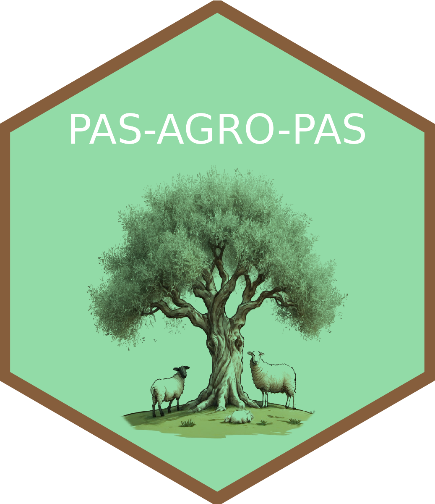

<!-- README.md is generated from README.Rmd. Please edit that file -->

# The Making of Fragile Agro-ecosystems Productive, Adaptive and Sustainable: Multifunctional Agro-pastoralism 

This repository gathers all outputs produced by the PRIMA EU-funded
project: [The Making of Fragile Agro-ecosystems Productive, Adaptive and
Sustainable: Multifunctional Agro-pastoralism
(PAS-AGRO-PAS)](https://prima-med.org/what-we-do/years/funded-projects-2022/).

The [PAS-AGRO-PAS GitHub
community](https://github.com/vcadavez/PAS-AGRO-PAS) involves protocols,
technical and scientific articles, and datasets on:

1.  Agro-pastoral production systems;
2.  Management and diversification of crop and pasture production;
3.  Productivity of livestock local breeds;
4.  Raise the economic potential and generational renewal of
    agro-pastoralism; and
5.  Promote the transition of traditional agro-pastoralism to the
    `Agriculture 4.0`.

------------------------------------------------------------------------

  
This work is licensed under the [GNU General Public
License](https://www.gnu.org/licenses/gpl-3.0).
